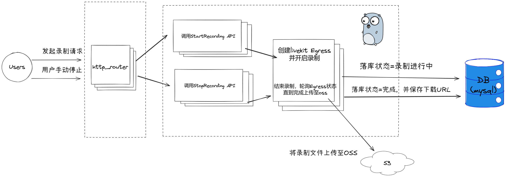

## 会议录制功能开发

## 技术栈
gin gorm livekit livekit-Egress minio mysql swagger

## 开发细节

没有特别复杂的逻辑，关键就是处理好消息的推送下游推送，以及使用好livekit-egress组件封装好的API即可，
比较花费时间的反而是前期调研的录制模版那里，需要在录制模版中填入自己部署好的录制模版渲染用的前端引擎，
这一块在livekit中已经做好了事例，拉下来官方的事例魔改成自己想要的模版即可。此处会用到`TypeScript`，`React框架`，后续可以多了解一些补足前端知识。